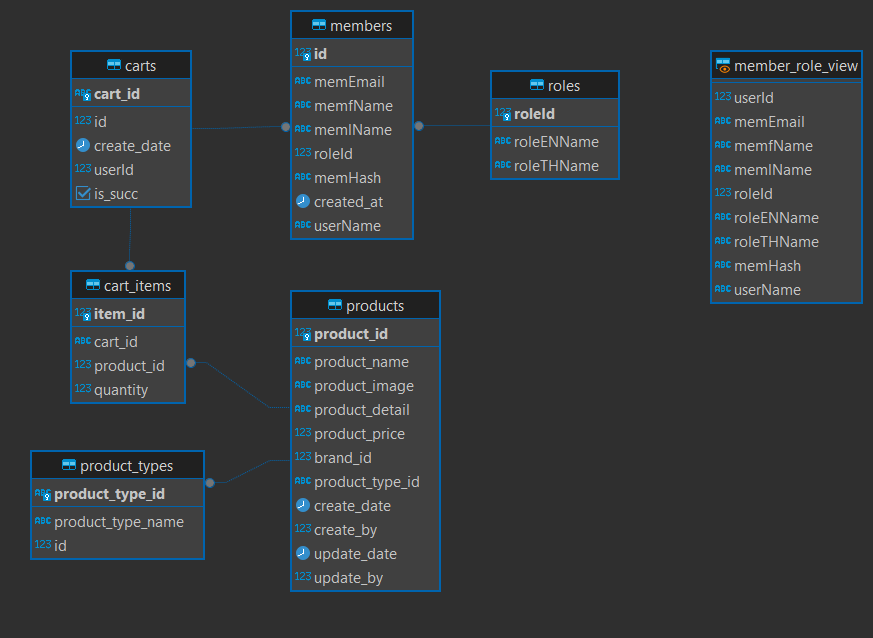

# Pet Shop Backend (Academic Project)

This project is the backend for the **Pet Shop** system, designed as an academic exercise to simulate a real-world pet shop system. It provides RESTful APIs for managing products, carts, user authentication, and other functionalities. The backend is built using **Node.js** and **Express.js**, with **PostgreSQL** as the database.

## Features

- **Product Management**: Add, update, delete, and retrieve product details.
- **Cart Management**: Manage customer carts, including adding items, updating quantities, and confirming orders.
- **User Authentication**: Secure login, logout, and user profile management using JWT.
- **Master Data Management**: Retrieve product types and other master data.
- **Swagger Documentation**: API documentation generated using Swagger.

## Tools & Technologies

| **Frontend** | Vue 3, Axios |
| **Backend** | Node.js, Express.js, REST API |
| **Database** | PostgreSQL |

## Related Repositories

This works together with the other repository to create the complete **Pet Shop** system:

- **Frontend Repository**: [PetShop Frontend](https://github.com/justnt47/PetShop_front_end_project)
- **Backend Repository**: [PetShop Backend](https://github.com/justnt47/PetShop_Back_end)

## Database ER Diagram

Below is the Entity-Relationship (ER) diagram for the database used in this project:

This project is for academic purposes only and is not intended for commercial use.
